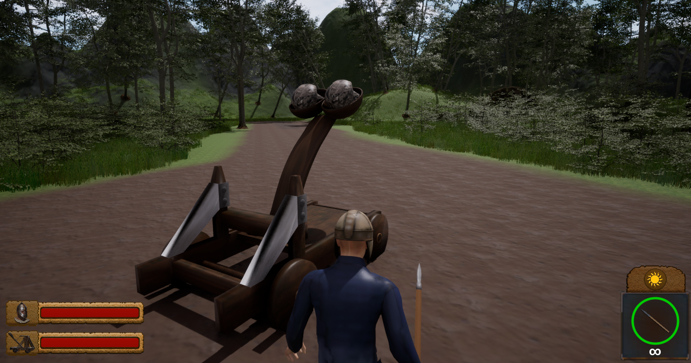
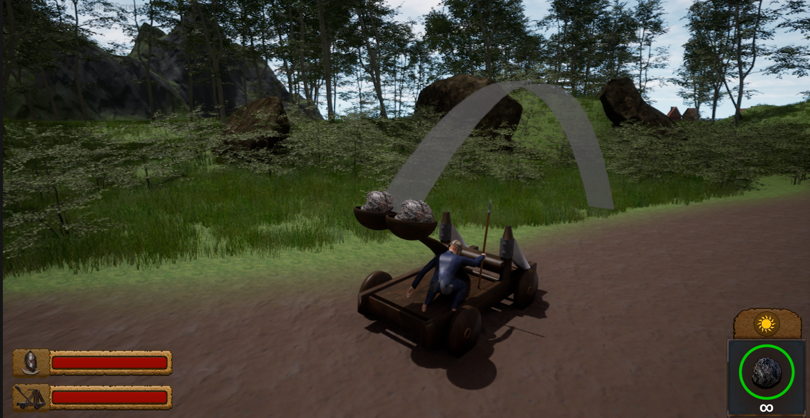
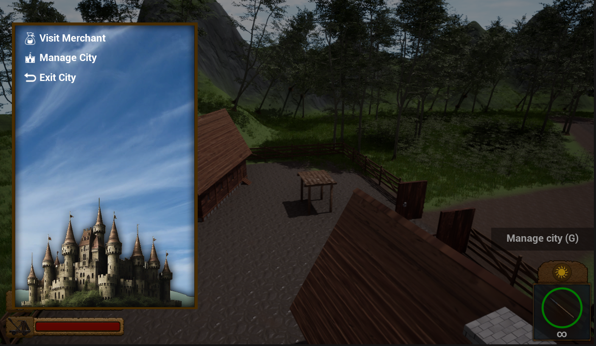
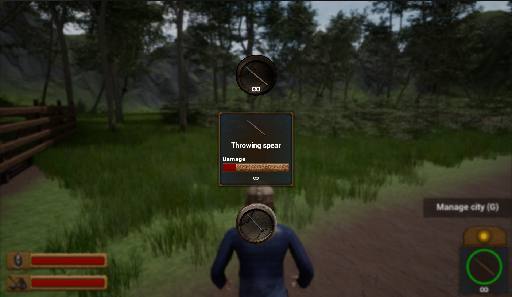
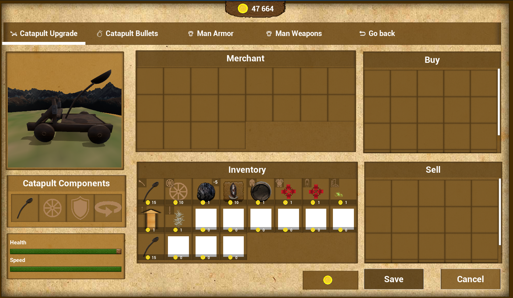

<h1>UE5 (Unnamed) game description</h1>

I started doing this project in early 2024 and I love working on it in my free time. I am developing this game using Unreal Engine 5. This is an open-world game set in medieval Europe. The goal of the game is to conquer the whole world. The player needs to wander around the world and look for castles that they will need to capture. The player has a catapult that deals damage from a distance, as well as the opportunity to throw a spear at enemies and use a sword for close combat. 

<strong>Below you can see the progress of what I am working on, in the coming months I will finish this project and self-publish it on Steam.</strong>

</img>
</img>
</img>
</img>
</img>
